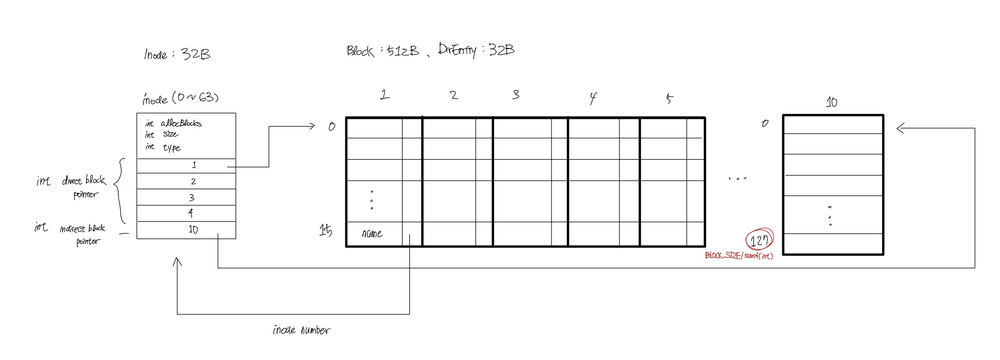

# File System

## Contents
* ### [이론](https://github.com/mingeun2154/FileSystem)
	* [Disk](file:///Users/mingeun/portfolio/FileSystem/README.md#disk)
	* [File System Info](file:///Users/mingeun/portfolio/FileSystem/README.md#File-System-Info)
	* [inode](file:///Users/mingeun/portfolio/FileSystem/README.md#inode)
	* [block](file:///Users/mingeun/portfolio/FileSystem/README.md#block)
	* [bitmap](file:///Users/mingeun/portfolio/FileSystem/README.md#bitmap)

* ### [구현](https://github.com/mingeun2154/FileSystem/tree/main/src)
	* [int MakeDirectory(char* name)](file:///home/mingeun/portfolio/FileSystem/README.md#makedirectorychar-name)
	* [int OpenFile(char* name, OpenFlag flag)](file:///home/mingeun/portfolio/FileSystem/README.md#int-openfilechar-name-openflag-flag)

##   
### Disk
   

##   
  
### int MakeDirectory(char* name)
> name : 생성할 디렉토리의 절대경로    
> return value : 0(성공) -1(실패)   
1. freeBock, freeInode가 존재하는지 확인  
2. new directory entry가 추가될 parent entry를 찾는다  
	1. direct block에서 탐색  
	2. indirect block에서 탐색  
3. 2번 과정에서 얻은 parent directory block에서 빈 entry를 찾는다
	1. 이미 존재하는 디렉토리인지 확인  
		1. direct block 탐색  
		2. indirect block 탐색  
	2. direct block에서 free entry를 찾는다
	3. indirect block에서 free entry를 찾는다
4. parent directory의 free entry(3번에서 찾은)에 new directory entry 추가
5. new directory block 생성
6. new directory inode 생성
7. Update metadata
	1. Update block, inode bytemap
	2. Update FileSysInfo

### int OpenFile(char* name, OpenFlag flag)    
> name : 생성할 파일의 경로  
> OPEN_FLAG_CREATE : 존재하지 않는 파일이면 __생성__ 하고 offset=0.  
> OPEN_FLAG_TRUC : file의 __내용을 지우고__ open. offset=0 으로 설정.   
> OPEN_FLAG_APPEND : __offset=(마지막 부분+1)__ 로 설정된다.   
> return value : open file의 descriptor value(성공) -1(실패)

