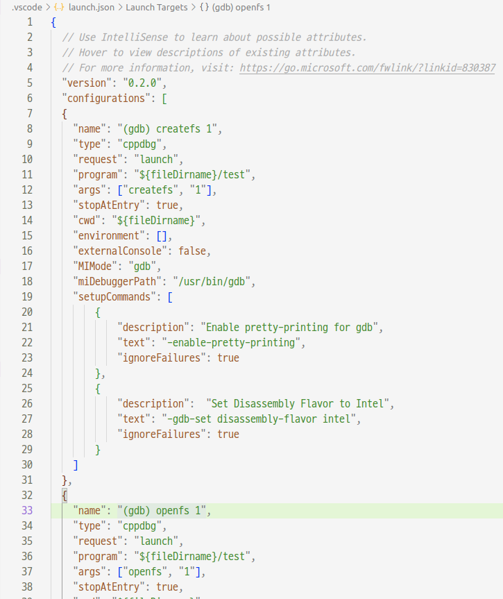

# File System

## Contents
* ### [이론](https://github.com/mingeun2154/FileSystem)
	* [Disk](https://github.com/mingeun2154/FileSystem#disk)
	* [File System Info](https://github.com/mingeun2154/FileSystem#File-System-Info)
	* [inode](https://github.com/mingeun2154/FileSystem#inode)
	* [block](https://github.com/mingeun2154/FileSystem#block)
	* [bitmap](https://github.com/mingeun2154/FileSystem#bitmap)


* ### [구현](https://github.com/mingeun2154/FileSystem/tree/main/src)
	* [int MakeDirectory(char* name)](file:///home/mingeun/portfolio/FileSystem/README.md#makedirectorychar-name)
	* [int OpenFile(char* name, OpenFlag flag)](https://github.com/mingeun2154/FileSystem#int-openfilechar-name-openflag-flag)
	* [int WriteFile(int fd, char* pBuff, int length)](file:///home/mingeun/portfolio/FileSystem/README.md#int-writefileint-fd-char-pbuff-int-length)
	* [int ReadFile(int fd, char* pBuff, int length)](https://github.com/mingeun2154/FileSystem#int-readfileint-fd-char-pbuff-int-length)  

* ### [디버깅](https://github.com/mingeun2154/FileSystem#%EB%94%94%EB%B2%84%EA%B9%85-1)

##   
### Disk
   

##   
  
### int MakeDirectory(char* name)
> name : 생성할 디렉토리의 절대경로    
> return value : 0(성공) -1(실패)   
1. freeBock, freeInode가 존재하는지 확인  
2. new directory entry가 추가될 parent entry를 찾는다  
	1. direct block에서 탐색  
	2. indirect block에서 탐색  
3. 2번 과정에서 얻은 parent directory block에서 빈 entry를 찾는다
	1. 이미 존재하는 디렉토리인지 확인  
		1. direct block 탐색  
		2. indirect block 탐색  
	2. direct block에서 free entry를 찾는다
	3. indirect block에서 free entry를 찾는다
4. parent directory의 free entry(3번에서 찾은)에 new directory entry 추가
5. new directory block 생성
6. new directory inode 생성
7. Update metadata
	1. Update block, inode bytemap
	2. Update FileSysInfo

### int OpenFile(char* name, OpenFlag flag)    
> name : 생성할 파일의 경로  
> OPEN_FLAG_CREATE : 존재하지 않는 파일이면 __생성__ 하고 offset=0.  
> OPEN_FLAG_TRUC : file의 __내용을 지우고__ open. offset=0 으로 설정.   
> return value : open file의 descriptor value(성공) -1(실패)

### int WriteFile(int fd, char* pBuff, int length)
> __length는 BLOCK_SIZE의 배수이며, 파일은 direct block만 사용한다고 가정했다.__  
> fd : write file의 descriptor value  
>	pbuff : 파일에 기록할 data가 기록된 메모리  
> length : 파일에 기록할 data 크기(byte 단위)  
> return value: 기록한 data 크기(성공) -1(실패)  

1. fd 값을 이용해 descriptor table->file table->file object에 접근하여 inode number, offset을 획득.  
2. file의 기존 내용을 가져와 fileBlock에 담는다. `char* fileBlock=malloc(BLOCK_SIZE*NUM_OF_DIRECT_BLOCK_PTR)`   
3. offset부터 pBuff의 내용을 fileBlock에 담는다.
4. fileBlock을 disk에 저장한다.
5. Update file inode, bytemap, FileSysInfo, file table(file offset).   

### int ReadFile(int fd, char* pBuff, int length)
> __length는 BLOCK_SIZE의 배수이며, 파일은 direct block만 사용한다고 가정했다.__  
> fd : read file의 descriptor value  
>	pbuff : 파일에서 읽은 data가 저장될 buffer.  
> length : 파일에서 읽을 data 크기(byte 단위)  
> return value: 읽은 data 크기(성공) -1(실패)  

1. fd 값을 이용해 descriptor table->file table->file object에 접근하여 inode number, offset을 획득.  
2. file의 기존 내용을 offset부터 가져와 fileBlock에 담는다. `char* fileBlock=malloc(BLOCK_SIZE*NUM_OF_DIRECT_BLOCK_PTR)`   
3. fileBlock의 내용을 pBuffer에 담는다.
4. fileBlock을 disk에 저장한다.
5. Update file inode, bytemap, FileSysInfo, file table(file offset).    


##

### 디버깅
__ubuntu 환경에서 vscode로 디버깅__  
vscode가 .vscode/launch.json 파일의 data를 보고 gdb를 실행해준다. GUI를 제공해 편리하다.
1. vscode extension C/++ 설치
2. terminal에서 gnu 컴파일러와 gdb 디버거를 설치한다.  
```Bash
gcc -v
sudo apt-get update
sudo apt-get install build-essential gdb
```
3. 실행파일에 디버깅 정보를 삽입하기 위해 Makefile 수정(-g 옵션 추가)   
```Makefile
test : test.o hw1.o hw2.o disk.o
	gcc -g test.o hw1.o hw2.o disk.o -o test
test.o : testcase.c
	gcc -g -c -o test.o testcase.c
hw1.o : hw1.c
	gcc -g -c -o hw1.o hw1.c
hw2.o : hw2.c
	gcc -g -c -o hw2.o hw2.c
disk.o : disk.c
	gcc -g -c -o disk.o disk.c
```
4. vscode 상단 menu bar -> Run -> Add Configuration -> 컴파일러, 디버깅 툴 선택 -> launch.json 생성  
5. launch.json 편집(실행파일 이름, 전달할 arguments, ...)   
  

	> 테스트에 필요한 arguments 별로 configuration을 설정했다.  
	> stopAtEntry를 true로 설정하면 자동으로 main함수 시작점에 breakpoint가 생성된다.
