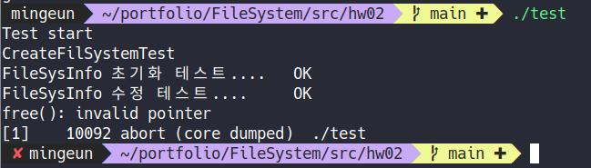

> hw02를 구현 과정에서  발생한 문제들과 해결과정

## issue01 : free(): invalid pointer  
* ### tirgger  
	CreateFileSystem() 함수를 테스트하기 위한 CreateFileSystemTest() 함수를 실행  
* ### error message
	   

	[core dump에 대한 설명](https://github.com/mingeun2154/index#%EC%9A%B4%EC%98%81%EC%B2%B4%EC%A0%9C)    
* ### 코드 분석
	```C
	/******************** Directory block Check ********************/
  printf("inode, data block 검사....\t");
  Inode* pInode=malloc(rootInodeNum); // 에러의 원인
  GetInode(rootInodeNum, pInode);

  if(pInode->type!=FILE_TYPE_DIR){ // 에러 발생 지점
    printf("Fail : type=%d\n", pInode->type);
    return -1;
  }

  rootBlockNum=pInode->dirBlockPtr[0];
  DirEntry* pDirBlock = malloc(BLOCK_SIZE);
  DevReadBlock(rootBlockNum, (char*)pDirBlock);

  if(strcmp(pDirBlock[0].name, ".")){
    printf("Fail : name=%s\n", pDirBlock[0].name);
    return -1;
  }
	```   
	FileInfoSys 수정 테스트 다음에 에러가 발생했기 때문에 그 부분을 조사하였다.

* ### 문제 해결
	동적할당을 통해 할당한 pInode가 가리키는 메모리의 크기가 잘못 설정되어있었다.  
	sizeof(Inode)만큼 할당되어야하는데 엉뚱한 값이 malloc의 인자로 전달되었다.
