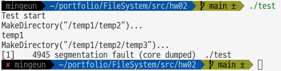
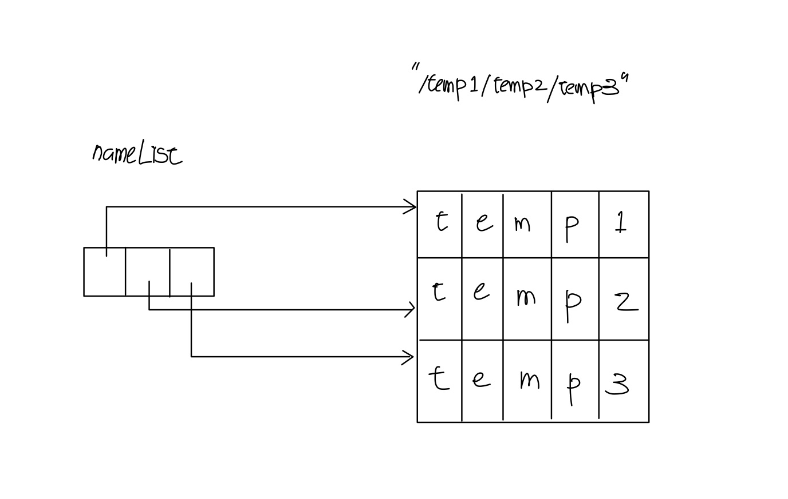

## issue02 : strtok() 함수
* ### tirgger  
	delimiter(구분자)가 두 개 이상인 문자열에 대한 적용
* ### error message
	   
  
* ### 코드 분석
	__strtok(char* str, const char* deli)함수__ 는 __str 문자열의 내용을 바꾸기__ 때문에 __포인터 변수가 아닌 상수 포인터__ 가 argument로 전달되어야 한다.
>	C에는 문자열을 선언하는 두 가지 방식에는 __상수 포인터__ 와  __포인터 변수__ 를 사용하는 두 가지 방법이 있다.
	* 상수 포인터  
	`char str[]="hello world";`    
	변수 str은 __항상__ "hello world" 문자열의 시작점을 가리키며 인덱싱을 통해 __문자 하나하나의 값을 바꿀 수 있다__ .
	* 포인터 변수( __read only memory__ )    
	`char* str = "hello world";`   
	변수 str은 "hello world"의 시작 주소를 저장하며 __값이 바뀔 수 있다.__ 가리키는 __atomic 문자열__ 이기  때문에 문자 하나하나의 값을 바꿀 수 없다.   

	```C
	int main(void){
			const char* str1 = "pointer variable";
		char str2[]="this is literal pointer";

		str1="hello world";
		str1[0]='x'; // 에러 발생
		str2="hello world"; // 에러 발생
		str2[0]='x';

		printf("%s\n", str1);
		printf("%s\n", str2);

		return 0;
	}
	```
   
* ### 문제 해결
	동적 할당을 통해 strtok() 함수가 반환하는 문자열을 가리킬 배열(nameList)을 선언한다.   
	그림으로 나타내면 다음과 같다.   
	   

	```C 
 	/** 중략 **/
	char** nameList=calloc(count, sizeof(char*)); // 절대경로의 이름들이 저장될 배열
	/** 중략 **/

	// 절대경로에 포함된 모든 디렉토리(파일) 이름을 전달받은 nameList에 담는다.
	void GetFileNames(char* name, int count, char** nameList){
		// count = (절대경로에 포함된 이름의 개수) = (SLASH 개수)
		char* path = calloc(strlen(name), sizeof(char)); // name을 쓰기가 가능한 메모리 공간에 담는다
		strcpy(path, name);
		char * token = strtok(path, SLASH_STRING);
		int i=0;
		while(token!=NULL){
			nameList[i++]=token;
			token=strtok(NULL, "/");
		}
	}
	```
