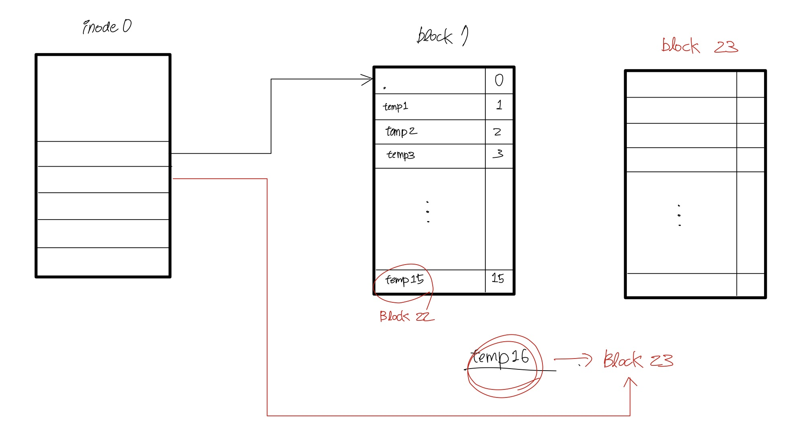
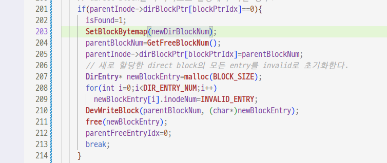

## issue03 : 추가로 direct block을 할당하는 경우
2022-06-17
  
* ### 문제 상황

root directory에 15개의 디렉토리를 생성하고 추가로 /temp16, temp17을 생성하는 경우,   
GetFreeBlockNum()을 통해 free block number를 획득한다. 하지만 MakeDirectory()함수가 시작할 때   
새로운 디렉토리의 data block number를 획득하기 위해 이미 GetFreeBlockNum()을 호출한 상태이다.   
__이때 GetFreeBlockNum()은 똑같은 값을 반환한다.__ 첫 번째와 두 번째 호출 사이에 GetFreeblockNum()이 참조하는
__block bytemap이 업데이트 되지 않았__ 기 때문이다.     
결국 16번째 directory가 entry로 존재할 root directory의 추가된 direct block과 temp16의 directory block이 겹치게 된다.   
   
    

```C
//test code
MakeDirectory("/temp1");
MakeDirectory("/temp2");
MakeDirectory("/temp3");
MakeDirectory("/temp4");
MakeDirectory("/temp5");
MakeDirectory("/temp6");
MakeDirectory("/temp7");
MakeDirectory("/temp8");
MakeDirectory("/temp9");
MakeDirectory("/temp10");
MakeDirectory("/temp11");
MakeDirectory("/temp12");
MakeDirectory("/temp13");
MakeDirectory("/temp14");
MakeDirectory("/temp15");

if(MakeDirectory("/temp16")<0){
	printf("%10s\n", "failed");
	return;
}
if(MakeDirectory("/temp17")<0){
	printf("%10s\n", "failed");
	return;
}

printf("%10s\n", "OK");
```
* ### 문제 해결
__적절한 시점__ 에 SetBlockByteMap()함수를 호출하여 bytemap을 업데이트해야한다.      
GetFreeBlockNum()를 두 번째로 호출하기 직전에 SetBlockBytemap()을 호출했다.  
이 시점이라면 이미 새로운 디렉토리를 만드는 것이 확정이기 때문이다.
> 남은 disk의 용량, parent directory의 남은 공간, 중복을 확인하기 전에는 디렉토리를 만드는 것이 확정되지 않는다.

   

