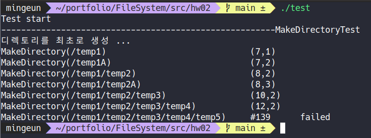
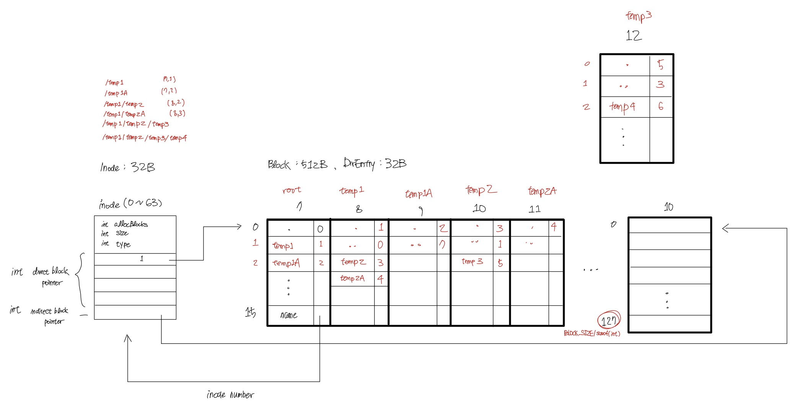
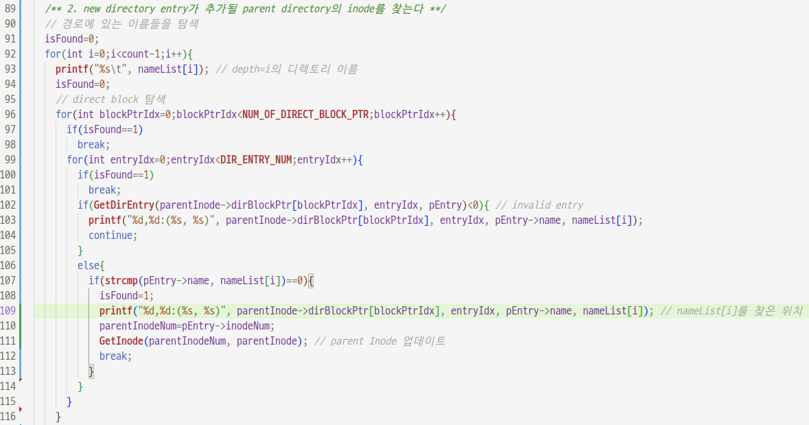
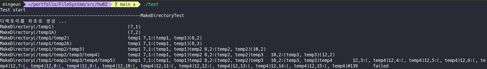
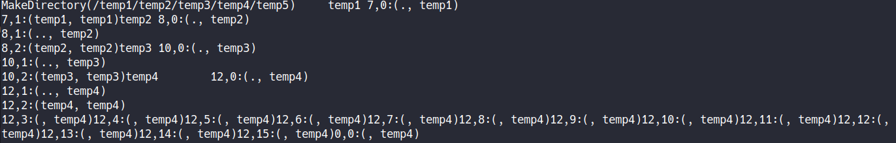
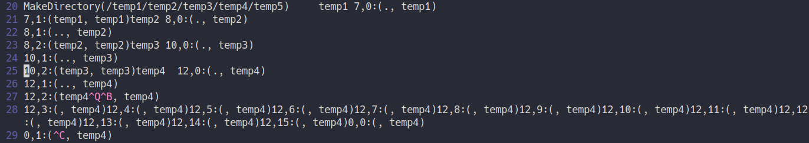
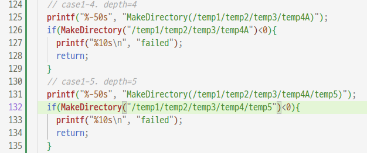

## issue04 : depth=4 이상에서의 디렉토리 생성
2022-06-18   

* ### 문제
`MakeDirectory("temp1/temp2/temp3/temp4/temp5")`에서 temp4부터 경로를 찾지 못한다.   

* ### 문제 분석 
   
   

> \#139는유효한 경로가 아닐때 출력되는 에러 코드이다.    
> (parent directory block number, entry index)

   

> 테스트 케이스를 표현한 그림   

 
   

> 경로 이름과 directory entry를 비교하는 코드

 
   

>	temp1은 block7의 entry1, temp2은 block8의 entry2, temp3은 block10의 entry2에서 찾을 수 있다.   
>  __temp4가 원래 있어야 할 자리(block12 entry2)에서 발견되지 않고__ 있다.

    

문제의 원인을 제공하는 부분은 두 가지로 예상된다.   
* temp4를 생성할때
* temp4를 찾을 때   
*왜 하필 depth=4에서부터 문제가 생기는걸까...*  
     

각 단계에서 비교하는 경로의 이름과 directory entry를 모두 출력해보았다.   
 
  
> command line에서 ./test 실행   

    

* ###  원인
  

	> ./test >> LOG   
	> \#line27을 보면 temp뒤에 __^Q^B__ 가 붙어있다. 이것때문에 strcmp()가 0이 아닌 값을 반환하게 된다.
 
     

* ### 문제 해결(임시)

  

> 테스트 코드에서 temp4를 temp4A로 이름을 바꾸어보았더니 이때에는 잘 작동했다.

__디렉토리 이름이 숫자로 끝나면 depth=5부터 중복된 경로의 디렉토리가 생길수 있다.__   
~~나중에 해결해야겠다...~~
