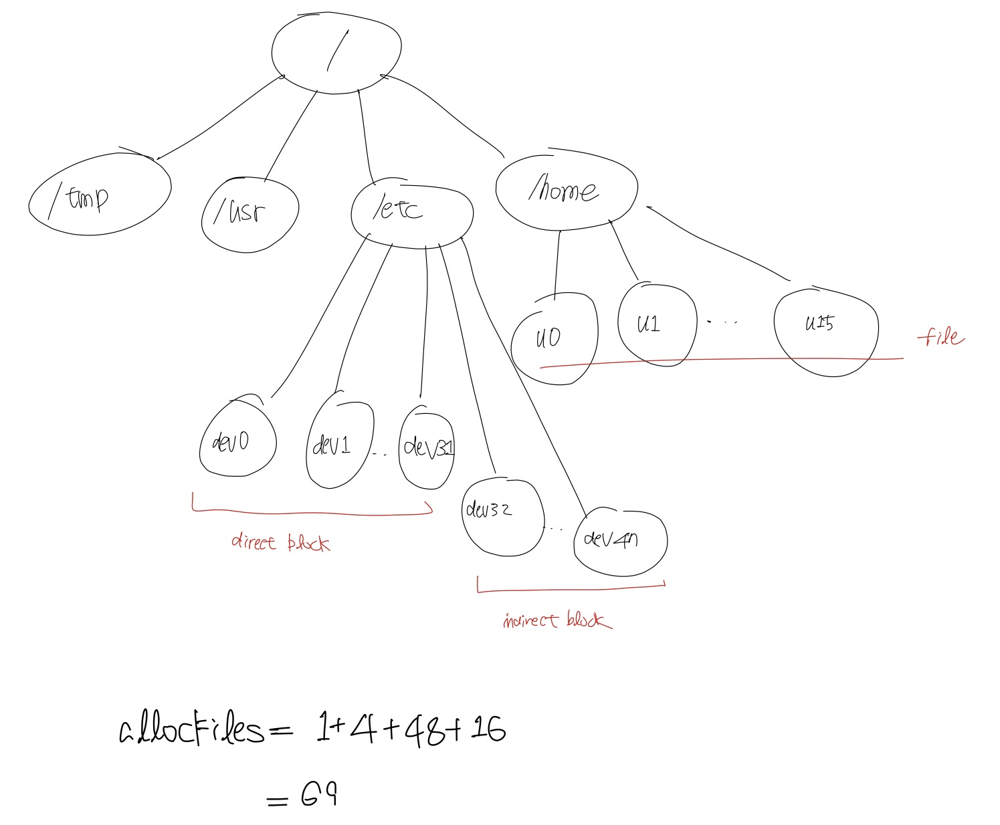
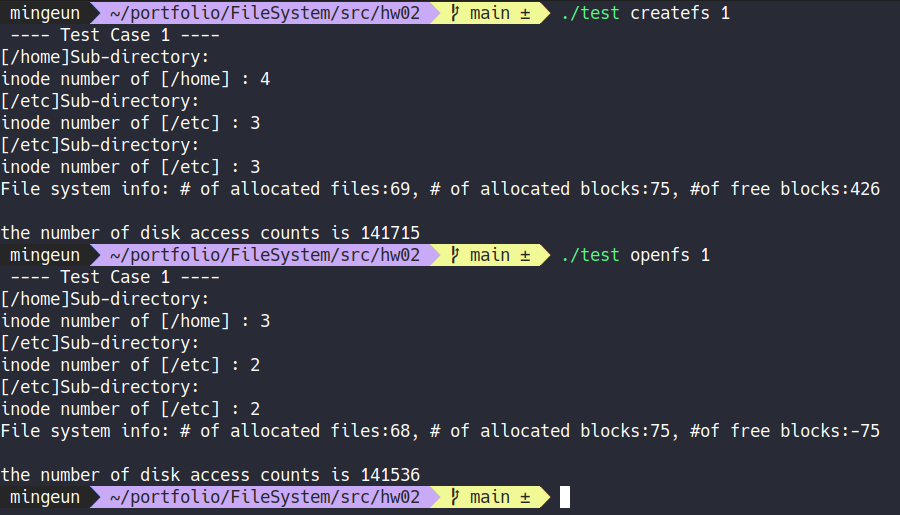
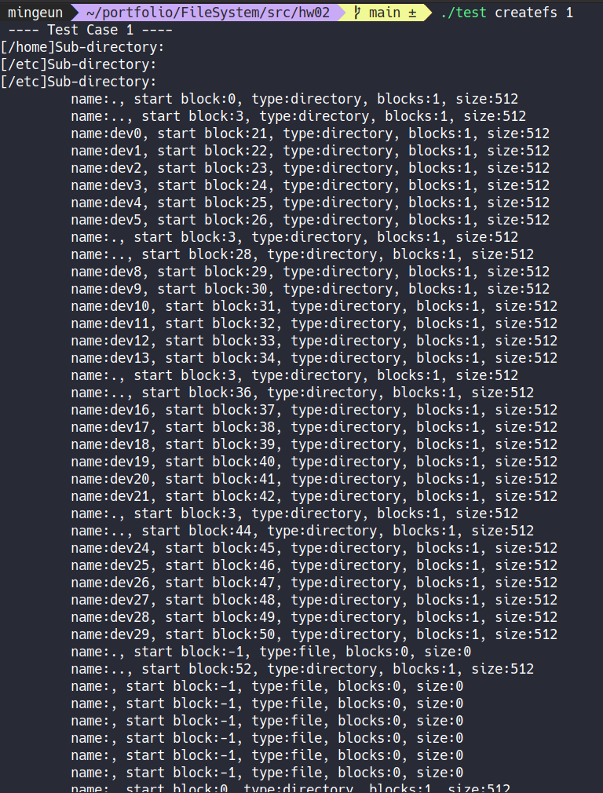
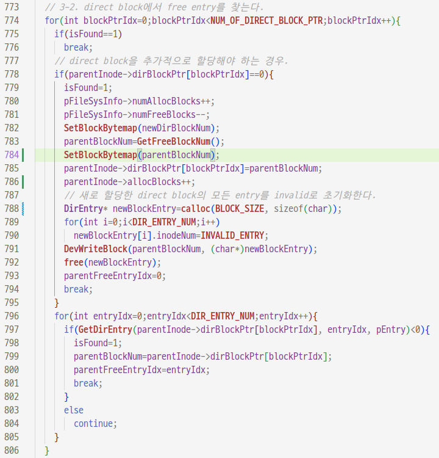
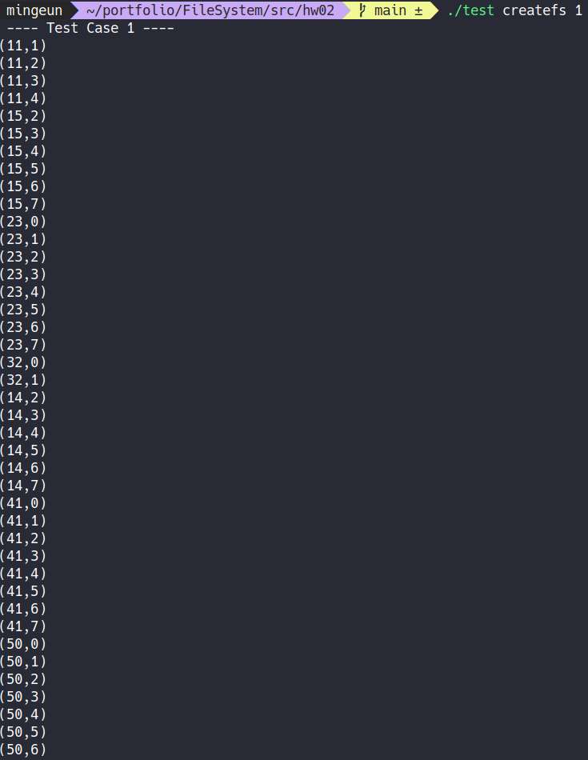
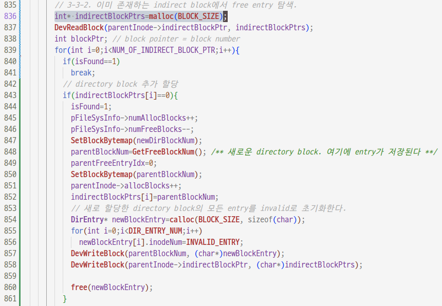

## issue05 : testcase1에서 발견된 문제
2022-06-21   

* ### 테스트 코드
```C
	#define DIR_NUM_MAX     100

	FileSysInfo     *pFileSysInfo;

	void TestCase1(void)
	{
		int i;
		char dirName[MAX_NAME_LEN] = {0};

		printf(" ---- Test Case 1 ----\n");

		MakeDirectory("/tmp");
		MakeDirectory("/usr");
		MakeDirectory("/etc");
		MakeDirectory("/home");
		/* make home directory */
		for (i = 0;i < 16;i++)
		{
				memset(dirName, 0, MAX_NAME_LEN);
				sprintf(dirName, "/home/u%d", i);
				MakeDirectory(dirName);
		}
		/* make etc directory */
		for (i = 0;i < 48;i++)
		{
				memset(dirName, 0, MAX_NAME_LEN);
				sprintf(dirName, "/etc/dev%d", i);
				MakeDirectory(dirName);
		}
		ListDirContents("/home");
		ListDirContents("/etc");

		/* remove subdirectory of etc directory */
		for (i = 47;i >= 0;i--)
		{
				memset(dirName, 0, MAX_NAME_LEN);
				sprintf(dirName, "/etc/dev%d", i);
				RemoveDirectory(dirName);
		}
		ListDirContents("/etc");
	}
```   

testcase1은 다음과 같은 디렉토리 상태에서 진행된다.  
  


* ### 테스트 결과

createfs는 가상디스크를 생성하고 openfs는 가상디스크를 open한다.  
createfs는 pc의 disk를 formatting하는 과정과 동일하고 openfs는 pc를 부팅하는 과정과 동일하다.  

  

> 문제1. createfs일 때에는 /home, /etc의 inode number가 정확하게 출력되지만 openfs일 때에는 정상적인 값보다 1이 작은 값이 출력된다.   

   

> 문제2. /home과 /etc의 하위 파일(디렉토리)들이 출력되지 않고 있다. ReadDirectory를 조사해보자.   
> 문제3. 반대로 etc directory의 하위 디렉토리들이 삭제된 뒤에는 출력되었다. MakeDirectory 함수를 조사해보자.  
> 문제4. dirBlockPtr[0]이 아닌 directory block에도 .과 ..이 entry로 들어가있다. MakeDirectory함수를 수정해야한다.  


* ### 문제 원인 분석  
첫 번째 문제 : 가상 disk에서 allocated block 한개가 누락되었다. 
두 번째 문제는 ReadDirectory 함수의 문제인것 같다.

* ### 문제 해결  
문제4 해결
  

> line#784 를 추가했다.    
> direct block에 공간이 없어 새로운 direct block을 할당받을 때 GetFreeBlock() 함수를 호출한 뒤 SetBlockBytemap()을 통해 block bytemap을 초기화하지 않아발생하는 문제였다.  
> /home/u7까지 생성되고 /home/u8가 생성될 때 /home에 새로운 direct block이 추가된다. 이 direct block의 번호는 GetFreeBlock()을 통해 획득할 수 있다.(k라고 하자.)   
> 그리고 그 다음 /home/u9이 생성될 때 /home/u9의 direct block이 필요한데 bytemap이 업데이트 되지 않아 GetFreeBlock() 함수가 또 k를 반환하게 된다.   
> __결국 /home의 두 번째 direct block과 /home/u9의 첫 번째 direct block pointer가 disk상의 똑같은 block을 가리키게 된다.__  그래서 뒤에 실행된 /home/u9의 direct block을 초기화하는 과정에서 0번째, 1번째 directory entry가 .과 ..으로 설정되었다.

  

> MakeDirectory() 함수에 `printf("(%d,%d)\n", parentBlockNum, parentFreeEntryIdx);` 와 같은 코드를 집어넣어 생성되는 모든 파일(디렉토리)가 저장되는 block number와 block entry number를 출력해보았다.   
> 저장되는 위치는 정확했다. 문제는 ReadDirectory()에서 일어나는 것 같다.


  

> line#836에 오타가 있었다. indirect block의 entry들은 int type인데 char 타입의 포인터로 가리키고 있었다.   
