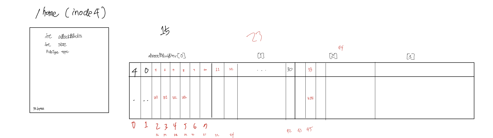
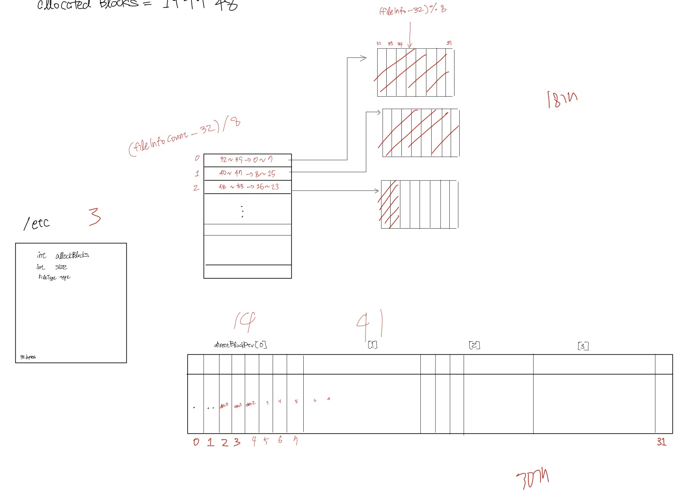
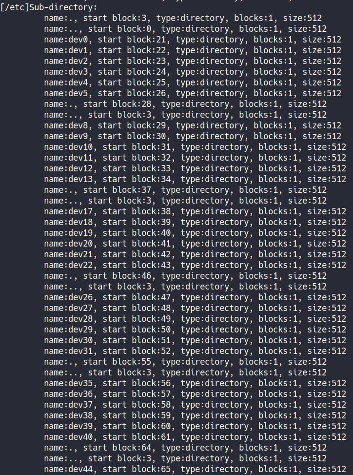
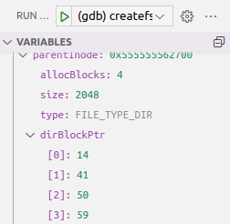
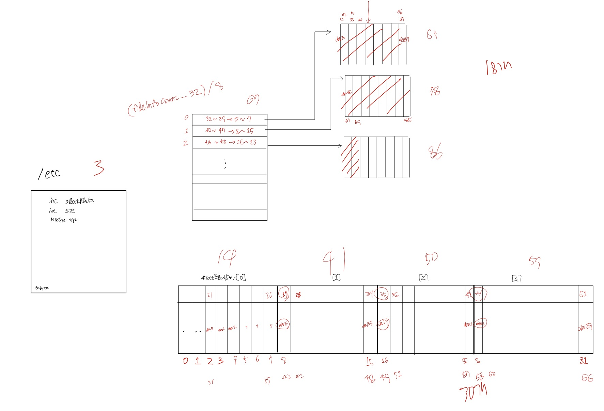

## issue07 : [testcase1] open file system
2022-06-23   

issue06을 해결하려고 이것저것 고치다가 문제가 발생했다.

* ### trigger
1. `./test createfs 1`은 가상 disk를 생성하고 /tmp, /usr, /etc, /home, /home/u0 ~ /home/u15, /etc/dev0 ~ /etc/dev47 디렉토리를 차례로 생성한다.   
	그리고 다시 /dev 하위의 48개 디렉토리를 모두 지운다.

	그리고 `./test openfs 1` 을 실행하면 

	   

	> /home

	

	> /etc

 

2. `./test openfs 1` 을 실행하면 1번 과정에서 생성되고 삭제되지 않은 /tmp, /usr, /etc, /home/u0 ~ /home15는 다시 생성되지 않는다. 
삭제된 dev/u0 ~ dev/u47을 다시 생성하고 지운다.  
__1번 과정의 RemoveDirectory() 또는 dev/u0 ~ dev/u47을 다시 생성하는 과정에서 문제가 발생한것 같다.__   

	

	> ./test openfs 1 결과  
	> 각 block들의 0번째, 1번째 entry에 의도하지 않은 값이 들어가있다.   
  
 

* ### 원인 분석

	   

	> 1번 과정의 MakeDirectory()에 breakpoint를 설정하고 /etc의 하위 디렉토리가 생성되는 과정을 추적했다.  
	> 제대로 진행되고 있었다.  

	   

	> etc의 directory blocks

* ### 문제 해결
RemoveDirectory()함수가 문제였다.   
direct block, indirect block이 가리키는 block의 entry가 삭제될 때 parent Inode의 dirBlockPtr, indirBlockPtr을 0으로 설정하지 않고, 사라지는 block을 bytemap에 반영을 해주지 않아서 발생하는 문제였다.
